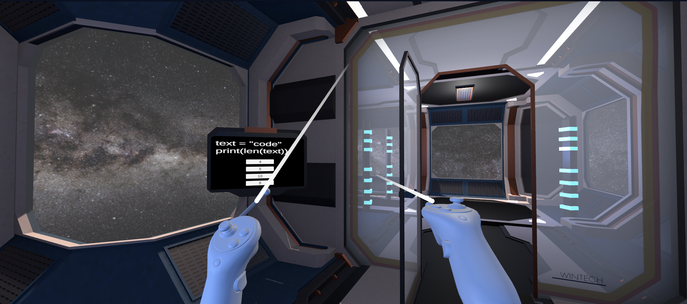

# 🧪 String Lab Escape (VR)

An interactive **VR escape room game** designed to teach and reinforce **inbuilt string functions** in a fun and engaging way.

Instead of finding keys, players must **learn string concepts** and then **solve coding-based puzzles** to escape each level. ⏱️

---

## 🎮 Game Concept

- Players enter a futuristic VR lab environment.
- Each level introduces a **string function concept**.
- After learning, players must **solve an interactive puzzle**.
- Solving the puzzle correctly will:
  - 🔓 Unlock the door  
  - 🌀 Open a portal to the next level  
- ⏳ A timer adds challenge — if it hits zero, the level restarts.

---

## 🚀 Features

- 🧠 Learn string functions interactively  
- 🧩 Puzzle-based progression system  
- 🕶️ Fully immersive VR environment  
- 🔓 Door unlocking + portal transition system  
- ⏱️ Time-based challenge mechanics  
- 🔁 Level restart on failure  
- 🎯 Escape-room style gameplay  

---

## 🛠️ Tech Stack

- Unity (XR Toolkit / VR Development)
- C#
- XR Device Simulator (for testing without headset)

---

## 📸 Game Output

### 🔹 Level Environment & Gameplay

#### 🖼️ Output 1 


<br>

#### 🖼️ Output 2 


<br>

#### 🖼️ Output 3 


<br>

#### 🖼️ Output 4


<br>

#### 🖼️ Output 5 


---

## ▶️ How to Run

1. Clone the repository:
   ```bash
   git clone https://github.com/Anuj0720/String-Lab-Escape.git